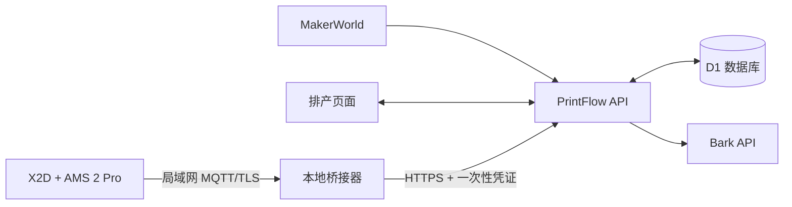

# PrintFlow

PrintFlow 是面向个人工作室的 3D 打印排产系统。它可以从 MakerWorld 导入打印项目，按可换盘时间、加急状态和交付期限生成队列，并通过 Bark 提醒下一次操作。项目还包含 X2D + AMS 2 Pro 的局域网 MQTT 状态读取能力。

当前版本不内置演示项目、演示打印机或伪造的实时状态。在全新数据库中首次打开时，项目库和打印机列表均为空；页面只展示用户实际录入或设备实际上报的数据。

## 主要功能

- 从 MakerWorld 链接读取项目名称、打印盘数量、总打印时间和每盘时间。
- 支持“整项目排产”和“拆分到每盘”两种规划颗粒度。
- 根据工作日、午休、夜间和休息日换盘窗口安排任务。
- 支持加急、DDL、失败缓冲和未按时开始后的重新排产。
- 通过 Bark 发送换盘、逾期和 DDL 风险提醒。
- 读取 X2D + AMS 2 Pro 的打印进度、剩余时间、层数、双喷嘴温度、热床温度、腔温、Wi-Fi、AMS 槽位、余量和温湿度。
- 使用适配器注册表隔离不同打印机协议；当前仅启用 `bambu-x2d-ams2pro`。

## 系统结构



云端站点不能直接访问家庭或工作室局域网，因此 MQTT 桥接器必须运行在与打印机相同网络中的 Mac、PC、NAS 或小型服务器上。

## 技术栈

- React 19
- vinext / Vite
- Cloudflare Workers 兼容运行时
- Cloudflare D1 + Drizzle ORM
- MQTT.js
- OpenAI Sites 私有托管

## 本地开发

需要 Node.js `>= 22.13.0`。

```bash
npm install
npm run dev
```

打开开发服务器输出的本地地址。D1 的本地数据保存在项目的 `.wrangler/` 目录中，该目录不会提交到 Git。

常用命令：

```bash
npm run lint          # 代码检查
npm test              # 构建并运行测试
npm run build         # 生成部署产物
npm run db:generate   # 数据库结构变化后生成迁移
```

## 使用 MQTT 桥接器

1. 打开 PrintFlow 的“打印机”页面。
2. 填写设备名称、X2D 序列号、局域网地址和 LAN Access Code。
3. 保存配置，下载 `printflow-x2d.env` 与 `printflow-x2d-bridge.mjs`。
4. 将两个文件放在同一目录中。
5. 在该目录安装依赖并启动：

```bash
npm install mqtt
node --env-file=printflow-x2d.env printflow-x2d-bridge.mjs
```

桥接器只订阅 `device/{serial}/report`，不会向打印机发送控制指令。更完整的常驻运行方式见 [DEPLOY.md](./DEPLOY.md)。

## 数据与安全

- 打印机 LAN Access Code 只用于在浏览器中生成本地 `.env`，不会提交给云端 API。
- 云端仅保存桥接凭证的 SHA-256 摘要；明文凭证只在创建或轮换时返回一次。
- MQTT 原始消息在服务端经过对应适配器，只保存排产页面需要的标准化字段。
- `.env*`、本地 D1 数据和构建产物均已加入 `.gitignore`。
- 生产站点默认使用私有访问，访问者需要通过 ChatGPT 登录。

## 目录说明

```text
app/                    页面与 API 路由
db/                     Drizzle 数据结构
drizzle/                D1 数据库迁移
lib/scheduler.ts        排产算法
lib/printers/           打印机适配器、类型与存储辅助
public/                  静态资源与可下载桥接器
bridge/                  桥接器说明
tests/                   适配器与无演示数据测试
.openai/hosting.json     Sites 资源声明
```

## 部署

当前仓库的直接支持目标是 OpenAI Sites + Cloudflare D1。生产发布、桥接器常驻运行、回滚和阿里云迁移边界见 [DEPLOY.md](./DEPLOY.md)。
