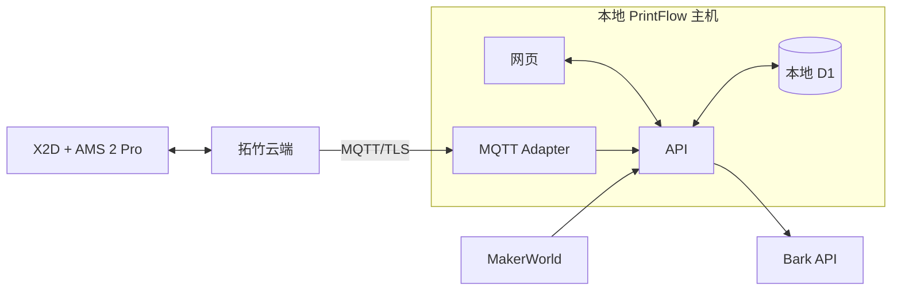

# PrintFlow

PrintFlow 是面向个人工作室的 3D 打印排产系统。它可以从 MakerWorld 导入打印项目，按可换盘时间、加急状态和交付期限生成队列，并通过 Bark 提醒下一次操作。

默认部署方式是“本地网页 + 拓竹云端 MQTT Adapter”一体运行：网页、API、数据库和 X2D Adapter 位于同一台 Mac、PC、NAS 或小型服务器上。打印机保持云端模式，Bambu Handy 可以继续使用，不需要 LAN Only、Developer Mode、打印机 IP 或 LAN Access Code。

当前版本不内置演示项目、演示打印机或伪造状态。全新数据库只显示空状态，页面数据来自用户实际录入或打印机实际上报。

## 主要功能

- 从 MakerWorld 链接读取名称、打印盘数、总打印时间和每盘时间。
- 支持“整项目排产”和“拆分到每盘”两种规划颗粒度。
- 根据工作日、午休、夜间和休息日换盘窗口安排任务。
- 支持加急、DDL、失败缓冲和未按时开始后的重新排产。
- 通过 Bark 发送换盘、逾期和 DDL 风险提醒。
- 读取 X2D + AMS 2 Pro 的打印进度、剩余时间、层数、双喷嘴温度、热床、腔温、Wi-Fi、AMS 槽位、余量和温湿度。
- 使用适配器注册表隔离打印机协议；当前仅启用 `bambu-x2d-ams2pro`。

## 局域网一体部署



网页、API、数据库和 MQTT Adapter 由同一个启动命令管理，对局域网只开放一个 `8082` 端口。浏览器始终调用当前 PrintFlow 地址下的同源 API，不会访问浏览器设备自身的 `127.0.0.1`。

## 快速开始

需要 Node.js `>= 22.13.0`。

```bash
npm install
npm run local
```

启动日志会显示局域网地址。在同一网络的电脑或手机上打开：

```text
http://<PrintFlow服务器局域网IP>:8082
```

`npm run local` 会先构建站点，再同时启动：

- 网页、API 与 MQTT Adapter：`0.0.0.0:8082`
- 本地 D1 与打印机配置：`.data/`

首次运行后，打开“打印机”页面，选择账号区域，填写拓竹账号和设备序列号。国际区通常使用邮箱；中国区可直接使用注册手机号。保存时网页会自动配置同机 Adapter。

## 连接拓竹云端 MQTT

1. 保持 X2D 的 LAN Only 关闭，并确保打印机已绑定到 Bambu Handy。
2. 在 PrintFlow“打印机”页面选择账号区域：国际区或中国区。
3. 中国区填写注册手机号，密码留空；国际区填写账号邮箱，可填写密码或使用验证码。
4. 密码留空时，第一次点击“保存并连接”会向账号手机或邮箱发送验证码；填写验证码后再次点击。
5. 登录成功后 Adapter 会连接对应的 MQTT 节点并开始同步。

账号、密码和验证码只用于当次 HTTPS 登录，不会保存到磁盘。登录成功后保存的是拓竹 Access Token。也可以在页面的高级选项直接输入已有 Token。

云端 MQTT 属于社区兼容协议，并非拓竹公开、稳定承诺的 API；云端升级后可能需要重新登录或更新适配逻辑。协议参考：<https://github.com/Doridian/OpenBambuAPI/blob/main/mqtt.md>

## 常用命令

```bash
npm run local          # 构建并启动本地网页 + Adapter
npm run local:start    # 使用已有 dist 启动本地网页 + Adapter
npm run dev            # 开发模式，仅启动网页开发服务
npm run lint           # 代码检查
npm test               # 构建并运行测试
npm run build          # 生成部署产物
npm run db:generate    # 数据库结构变化后生成迁移
```

## 数据与安全

- 拓竹账号、密码以及短信或邮箱验证码不会保存到磁盘。
- Access Token 保存在 `.data/printer-config.json`，文件权限限制为当前服务账户读写。
- Token 不会写入网页数据库；它仅由一体服务用于连接拓竹 API 和 MQTT。
- Token 通常约三个月有效，失效后需要在打印机页面重新登录。
- `.data/`、`.env*`、本地 D1 和构建产物均不会提交到 Git。
- Adapter 只订阅 `device/{serial}/report` 状态主题，不会向打印机发送控制指令。

## 目录说明

```text
app/                    页面与 API 路由
db/                     Drizzle 数据结构
drizzle/                D1 数据库迁移
lib/scheduler.ts        排产算法
lib/printers/           打印机适配器与标准化数据模型
local/                  本地一体启动器和 MQTT Adapter 服务
public/                  静态资源与独立云端 MQTT Adapter
tests/                   自动化测试
wrangler.local.jsonc     本地 Worker、资源和 D1 配置
.openai/hosting.json     可选 Sites 部署声明
```

生产常驻运行、备份和升级见 [DEPLOY.md](./DEPLOY.md)。
